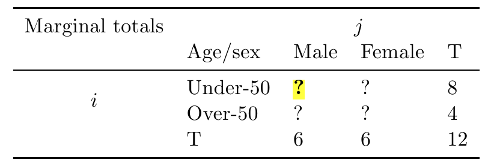
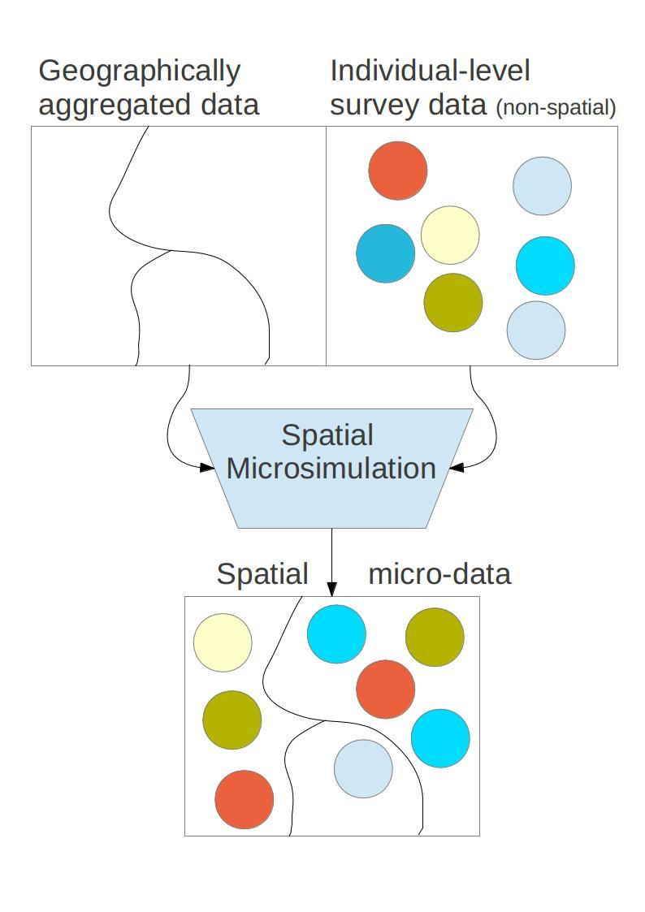

Evaluating the performance of IPF 
========================================================
font-family: 'Helvetica'
transition: rotate
<large> **new tests for an old technique** </large>

Robin Lovelace   
[RSAI-BIS](http://www.rsai-bis.org/) August 2013  
Wednesday 21^st  11 - 13, early careers session


Introduction
========================================================


- Iterative proportional fitting is an established statistical technique [(Deming, 1940)](http://www.jstor.org/stable/10.2307/2235722)
- It estimates the values of internal cells, based on marginal totals:    

- Used in spatial microsimulation for allocating individuals to zones [(Lovelace et al., 2013)]( http://dx.doi.org/10.1016/j.compenvurbsys.2013.03.004)

How IPF works 1 - visually
========================================================
Visually, this can be seen as follows:

Selection of variables used to sample individuals

People most representative of the target area selected

(Optional) process of integerisation converts weights into whole individuals

------------------------
  

How IPF works 2 - in maths
========================================================
$$
w(n+1) = \frac{w(n) \times sT_{i}}{mT(n)_{i}}
$$

- where, $w(n+1)$ is the individual's new weight,
- $w(n)_{ij}$ is the original weight, 
- $sT_{i}$ is the marginal total of the small area constraint
- $mT(n)_{i}$ is the aggregate results of the weighted microdataset

Apply this algorithm, one constraint at a time, to every area in the case study

How IPF works 3 - in code
=================================================
Main algorithm:  

```r
for (j in 1:nrow(all.msim)){
  for(i in 1:ncol(con1)){
 weights[which(ind.cat[,i] == 1),j,1] <- con1[j,i] /ind.agg[j,i,1]}}
```

Or in English:
- for each zone, set the new weight of individuals in each category equal to their true number divided by their current number in the simulation
- May need worked example to 'get it' (took me 3 months!)

The need for testing
============================================
It is well-known that IPF works:
- converges towards a single result
- robust and computationally efficient
- has been used in many spatial microsimulation studies

Much less is know about the factors influencing its performance.  
Are there ways IPF should or should-not be set-up?

Baseline scenarios
===================================
Three baseline scenarios were used:
- a simplest possible case, with 5 areas, 10 individuals and 2 constraints
- 'small area' constraints: 24 '[OA](http://www.ons.gov.uk/ons/guide-method/geography/beginner-s-guide/census/output-area--oas-/index.html)' zones, ~1,000 individuals and 3 constraints
- 'Sheffield', containing the 71 '[MSOA](http://www.ons.gov.uk/ons/guide-method/geography/beginner-s-guide/census/super-output-areas--soas-/index.html)', ~5,000 individuals and 4 constraints

Most tests were done on the 'small area' scenario

Model experiments
=====================================
The impact of the following changes was tested:
- number of iterations
- number/order of constraints
- initial weights
- ratio of survey size:zone areas
- empty cells
- integerisation

Results 1
=======================================
Initial weights have very little impact on the results
(their impact diminished to almost zero after 2 iterations)


Summary of findings
=======================================


Conclusions and further work
======================================

References
========================================
<small>
Deming, W. (1940). On a least squares adjustment of a sampled frequency table when the expected marginal totals are known. [The Annals of Mathematical Statistics](http://www.jstor.org/stable/10.2307/2235722) 

Lovelace, R., & Ballas, D. (2013). “Truncate, replicate, sample”: A method for creating integer weights for spatial microsimulation. [*CEUS*, 41, 1–11](doi:http://dx.doi.org/10.1016/j.compenvurbsys.2013.03.004)

</small>

