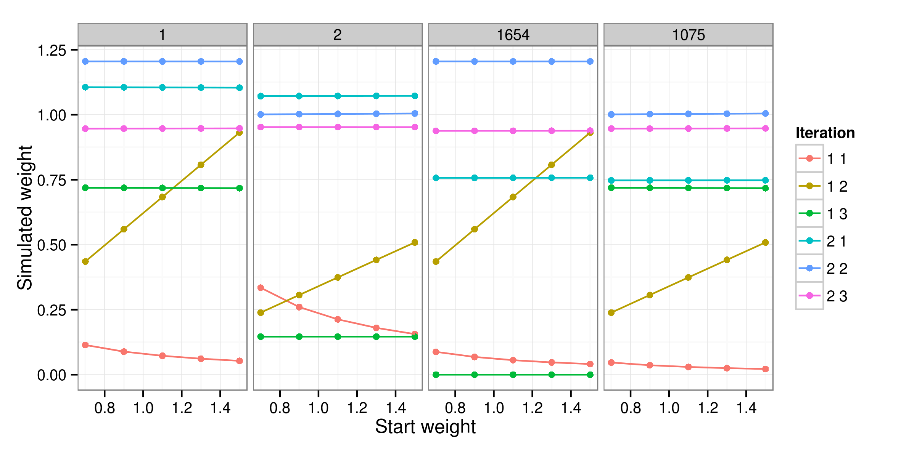

```{r, echo=FALSE}
# logo: ~/Dropbox/Public/img/logos/cdrc-square.png
```

## Motivation

- Dozens of methods available for (spatial) microsimulation
- Difficult to choose from options
- Testing can be time consuming and tricky [[@harland2012]](http://jasss.soc.surrey.ac.uk/15/1/1.html)

**Need for fast and consistent testing framework**

**Broader motivations**

```{r, echo=FALSE}
# image here of Times article
# data analysis: process of persuading people to change opinion on evidence
```


## Problem: each researcher has their own 'horse' in the race


# Past testing efforts in the literature

## The 'model experiment' genre


- Harland, K. et al. (2012). Creating Realistic Synthetic Populations at Varying Spatial Scales... [JASSS](http://jasss.soc.surrey.ac.uk/15/1/1.html), 15(1), 1.
- Huang and Williamson (2001). A comparison of synthetic reconstruction and combinatorial optimisation approaches to the creation of small-area microdata. [Working Paper](http://pcwww.liv.ac.uk/~william/Microdata/Pop91/Methodology/workingpapers/hw_wp_2001_2.pdf).
- Ryan, J., Maoh, H., & Kanaroglou, P. (2009). Population synthesis: Comparing the major techniques using a small, complete population of firms. [Geographical Analysis](http://onlinelibrary.wiley.com/doi/10.1111/j.1538-4632.2009.00750.x/full), 41(2), 181–203.

```{r, echo=FALSE}

```

## Results from past work

- Many useful findings - often researcher's own model 'best'
- No conclusive results - not reproducible - comparing different things


## Microsimulation as an experimental procedure

- Controlled experiments are the foundation of science
- Real-world experiments impossible
- Simulation allows range of alternatives to be tested safely

Simulation, then is the process of
imitating the behavior of system patterns.
Simulation as one method of problem-solving becomes attractive when conventional analytic, numeric or physical experimental methods would be too time-consuming, expensive, difficult, hazardous and/or irreversible or even impossible as real world experiments intended to solve a problem. (Merz, 1991). **International Journal of Forecasting 7 (1991) 77-104 77**

# IPF performance testing

## Setting-up model the experiments

- 'Scrambled' versions of official datasets used
- Work ongoing on larger examples

```{r, echo=FALSE, fig.height=4, fig.width=5}
# - All examples on-line deliberately small for portability
library(grid)
library(png)
grid.raster(readPNG("figure/ipfinac.png"))
```

## Project organisation

```
|-- data-big (just README links)
|-- figure
|-- input-data
|   |-- sheffield
|   |-- simple
|   `-- small-area-eg
|-- literature
|-- models
|   |-- ipfinr
|   |-- FMF
|   |-- simSALUD
|   `-- GREGWT
`-- output
```
## Try it yourself!


## Replicable results

Reproducible example:

```{r}
source("models/etsim.R")
```

## Results 

- 'Empty cells' found to have largest impact on fit
- **Initial weights had very little impact**
- C code (**ipfp** package): **50 fold** speed increase

```{r, echo=FALSE}
library(grid)
library(png)
grid.raster(readPNG("figure/weights-exp-54nice2.png"))
```



# Broadening the tests

## CO in FMF vs IPF in R

- New project to test techniques on very large microdatasets
- Challenge: allocate 569,741 individuals to 7,787 zones
- Almost 60 million people in output spatial microdata!
- New methodology for IPF developed

[](http://eprints.ncrm.ac.uk/3177/)

## External validation

- More important that 'internal validation' is how well results fit reality
- Opportunity provided by Census variable on census well-being
- Simulated at small area level with FMF and R

## Work in progress

- Compare different approaches in terms of timing, model fit and ease of use
- External validation
- Use alternative methods to generate same output: [GREGWT](http://www.researchgate.net/publication/257017550_Simulating_the_characteristics_of_populations_at_the_small_area_level_New_validation_techniques_for_a_spatial_microsimulation_model_in_Australia/file/72e7e527aa73850417.pdf)? [SimObesity](http://link.springer.com/chapter/10.1007/978-94-007-4623-7_5#page-1)? [simSALUD](http://www.simsalud.org/simulation/)?


# Wider context of spatial microsimulation

## Issues within the field

- "Little
attention is paid to the choice of programming language used" for
microsimulation [@Holm1987]
- Lack of reproducibility [@Lovelace2013-trs]
- Hard to get started
- Few simple examples - uses tend to be big and complicated
- Few introductory teaching resources

## Teaching spatial microsimulation

- Two courses in May (Leeds) and August (Cambridge)
- Taught basic principles of spatial microsimulation
- And implementation in R
- Feedback: students grateful for first rung on ladder
- More success with latter course focussing on applications

.jpg)

## Spatial microsimulation introductory textbook

- Contract with CRC Press as part of their [R Series]()
- Draft of book available online in its entirety
- Open 'wiki' style allows anyone to contribute
- Any feedback/input gratefully received
- Check it out here: [robinlovelace.net/spatial-microsim-book/](http://robinlovelace.net/spatial-microsim-book/)


## Key References

