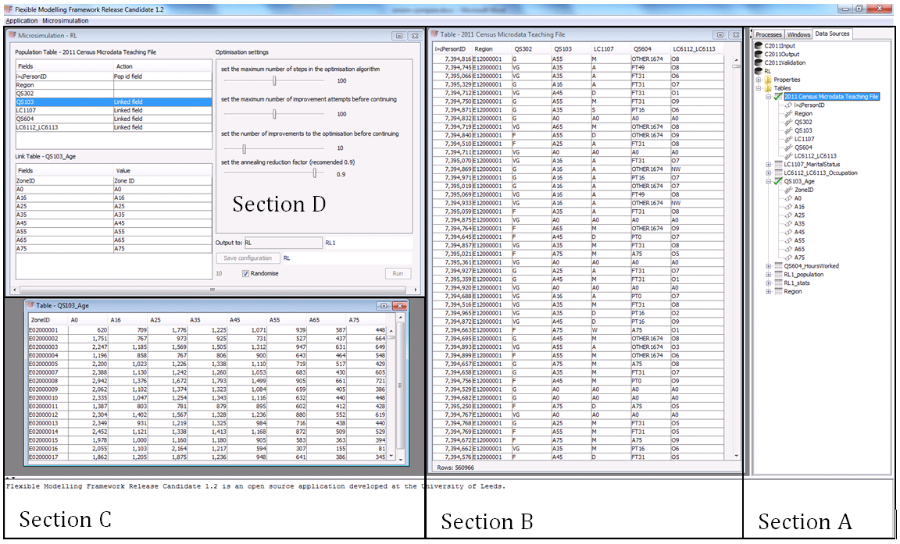

```{r, echo=FALSE}
# setwd("../")
library(png)
library(grid)
```


Aims:

1. Compare the performance of different methods and software
products for generating spatial microdata with large input datasets.
2. Use 'external validation' to assess the suitability of spatial microsimulation
for estimating subjective well-being.

## Introduction

Model testing has been a recurring topic in the field of microsimulation. Voas and Williamson (2000) tested a range of combinatorial optimisation approaches for the generation of spatial microdata. Rahman et al. (2010) compared a range of reweighting techniques. Most recently, Harland et al. (2012) tested a number of approaches including deterministic reweighting and simulated annealing. Each study provides useful resources to the microsimulation community, by highlighting options available and suggesting which solutions may be best for particular applications. This paper returns to the issue of model testing based on three factors: 1) evolution of new software and methods; 2) the need for more transparent, systematic and reproducible tests; and 3) the need to implement tests under a wider range of conditions. Microsimulation models are diverse and constantly evolving, so the paper focusses on methods for model testing rather than just results. Example datasets and code will be provided, allowing the test results presented in the paper to be reproduced. Iterative Proportional Fitting, simulated annealing and genetic algorithm approaches to static spatial microsimulation will be tested based on the publicly available individual-level ‘2011 Teaching File’ (ONS, 2014). The results will provide insights about model setup for optimal results of deterministic and probabilistic approaches and facilitate future benchmarking of alternative, perhaps more sophisticated, methods.

## The data 

All datasets used in this study come from the UK's 2011 Census of population, for England and Wales. The *microdata* input has a very coarse geography (the Government Office Region level, which contains only 10 zones across England and Wales) but is advantageous in allowing for custom cross-tabulations of variables and modelling approaches such as dynamic microsimulation and agent-based modelling. The purpose of spatial microsimulation in this context is to synthesise an individual-level dataset that is representative of smaller geographical units --- middle level super output areas (MSOAs), of which there are 7,201 in the study area --- in terms of the aggregate-level constraint variables.

The aggregate-level datasets are supplied via the Nomis data portal. These have the advantage of geographical specificity but are limited in terms of lacking information about the cross-tabulations between different variables and the distribution of individual-level charachteristics (e.g. health). These datasets are introduced below.

### The individual-level data

For the spatial microsimulation the sampling population used is the 2011 Census microdata teaching file (ONS, 2014). This file contains the individual census responses on 17 census questions from 569,741 individuals living in England or Wales, a 1% sample of all such Census returns. The population base for this sample includes usual residents, students who are living away from home during term 
time^[Schoolchildren and students in full-time education studying away from their family home are treated as usually resident at their term-time address. Basic demographic information only is collected at their non-term-time address. The information on families, household size and household composition for their non-term-time address does not include them.]
and short-term residents. To ensure compatibility with the population bases used in the constraint population (see below), only the usual population residents are retained within the sampling populations. Within this sub population there are a further 74 individuals whose response on the outcome of interest, self-reported health status, is un-coded. These individuals have been further excluded. The sampling population is therefore composed of 560,966 individuals. 

To identify a subset of the 17 census questions to use as constraints use is made of Cramer's V statistic (Cramer, 1946) to measure the strength of association between each candidate constraint question and self-reported general health. The value of this statistic ranges from 0.0 to 1.0 with a higher value indicating a higher association between the categories of each question. The value of the statistic for each of the 17 census question with the general health question is given in table 1.

```{r, echo=FALSE}
# Of the 17 variables included in this dataset, 5 are of particular interest in this study:
# 
# - Region: this is the Government Office Region (GOR) of the individual's home.
# There are 10 GORs in England and Wales: 9 for England and 1 representing Wales.
# - Age and sex: these are standard constraint variables for selecting representative
# individuals.
# - Ethnic group: ethnicity was used as a constraint variable: it
# has been found to be an important determinant of health,
# especially when one considers its interaction with other variables.
# - Occupation: This categorises individuals by class and was used as a constraint variable.
# - Health: this is the 'target variable' that we will be estimating at the
# small area level. It is a self-reported likert index from 1 ("very good") to 5
# ("very bad").
```

```{r, echo=FALSE}
# df <- read.csv("tables/cramer.csv")
# df <- df[order(df$Cramer.s.V, decreasing = TRUE),]
# library(knitr)
# kable(df, row.names = F)
```

|Question                 | Cramer's V|
|:------------------------|----------:|
|Economic activity        |      0.320|
|Student                  |      0.303|
|Age                      |      0.268|
|Marital status           |      0.193|
|Approximate social grade |      0.180|
|Occupation               |      0.158|
|Industry                 |      0.144|
|Hours per week           |      0.118|
|Family composition       |      0.105|
|Residence type           |      0.073|
|Religion                 |      0.054|
|Gender                   |      0.035|
|Ethnic group             |      0.033|
|Region                   |      0.032|
|Country of birth         |      0.017|

The question with the greatest association with general health is economic activity. This result is likely to be skewed by the presence of the category, 'economically inactive: long-term sick or disabled' which correlates strongly with the bad health responses. This strong degree of association almost trivialises the prediction of bad health and provides a justification for not including this question as a constraint. Two questions that have very good association with general health are student status (students are most likely to have very good or good health) and age (younger people are more likely to have very good or good health).

Of the 17 census questions within the microdata teaching file there will some whose responses will be correlated. Thus knowing the response on one question will mean that the additional information in the correlated question will be negligible. Examples are: family composition which is correlated with marital status; religion with ethnicity; and occupation, industry and approximate social grade. In the selection of questions to use as constraints, only one question from such pairings should be used. **Marital status** has a greater association with general health than family composition. Both ethnicity and religion have poor associations. Of the employment grouping either **occupation** or approximate **social grade** are worthy of consideration as constraints. **Hours per week** is the only remaining question with a Cramer’s V above 0.10 and some distance from the next highest, residence type.

### Constraint tables

The size of the usually resident English and Welsh population from the 2011 Census
is 56,075,912. For spatial microsimulation to work,
every constraint table should contain this exact number of individuals.

```{r, echo=FALSE}
# ???? Students ????
```

The **age** constraint is constructed from an aggregation of the single year of age counts in table QS103 to those age groups that match the corresponding question in the sampling population.

The **marital status** constraint is built on table LC1107. The responses for a marital status of ‘married’ and ‘in a registered same-sex civil partnership’ are aggregated to be consistent with the definition used in the corresponding question in the sampling population. This table excludes those aged 15 or younger which necessitates the inclusion of a category ‘Aged 0 to 15’ to ensure the counts in the table match the England and Wales population. This count is taken from the age constraint table.

The **occupation** constraint is built from two tables, one that gives counts for current occupation (LC6112) and one that gives a count of former occupation or never worked (LC6113). Once again, since this table excludes those aged 15 and younger a count of such people is added as an additional category.

**Number of hours worked** is primarily taken from table QS604 which lists the hour worked by individuals aged 16 to 74 in employed.  To ensure that the count in this table equals the population of England and Wales it is necessary to add categories that: count those aged 15 and younger; count those aged 75 and older (both once more from the age constraint table); and those aged 16 to 74 who are not in employment. This later count is derived as the difference between the aged 16 to 74 populations from the age constraint table minus those in employment (i.e. those counted as either in full or part time employment in QS604).

Unfortunately the tabulations for approximate social grade (e.g. QS613EW) only include individuals resident in a household which is not compatible with the usual resident population adopted for the sampling population. It is thus not possible to define a compatible constraint table for this question.

### Geography

### Data preparation Processing 

We used only population base 1, "Usual resident" to ensure compatibility with
the constraint tables, which are usually based on usual residents. Even after
this, there were still 74 individuals with a Health status of -9.

The categories were recoded...

## Method

## Combinatorial optimisation with FMF

One approach to estimating a spatial microsimulated population for a zone is to select a combination of individuals from within the individual-level data whose aggregation of by attributes best match the zones counts in the constraint tables. The agreement between these aggregated individual-level counts and those in the constraint tables can be measured using a variety of metrics (REF NEEDED). A common metric adopted is the total absolute error (TAE), which sums the absolute differences between these two counts across all the categories within the tables.  The objective is to minimize this metric to zero. Of critical importance to this approach is the efficiency of the algorithm used use to repeatedly modify this selection of individuals so as to achieve a reduction in TAE.

One implementation of such an approach is that termed the Flexible Modelling Framework (FMF) developed at the University of Leeds (Harland, 2013). The approach involves the use of a simulated annealing algorithm to perform the optimization stage. The algorithm is also build within an intuitive user interface in which the user is able to set links to external data and configure the spatial microsimulation model.

To set up a spatial microsimulation within the FMF is trivial if certain conventions are followed in construction the individual-level data and constraint tables. The important convention is an equivalence in labelling between the attribute level in the individual-level data and the categories within the constraint table. Thus if a person in the individual level data who is 48 years old is coded as ‘A45’ (to represent a person who is aged 45 to 54) and there is a category in the age constraint table labelled ‘A45’ then the software will automatically establish this correspondence between the individual-level attribute and the category in the constraint table.  If necessary these correspondences can be over ridden by the user. 

This approach can be seen in figure 1. This figure shows the data files that have been loaded into the FMF (section A); the first few rows of the individual-level data (section B); the first few rows of the age constraint table (section C) and the microsimulation configuration window (section D). Here the individual-level data as shown in section B has a field labelled QS103 which is coded as the age range for each individual, this can only take one of the eight values ‘A0’, ‘A16’, ‘A25’, ‘A35’, ‘A45’, ‘A55’, ‘A65’, or ‘A75’ (the digit being the lower bound of an age range). These labels correspond exactly with the category labels in the age constraint table in section C. The FMF has recognized this and automatically established the linkages for this constraint table. Similar linkages can be established for the other constraint tables.

```{r fmfimg, fig.cap="Graphical user interface (GUI) of the Flexible Modelling Framework", echo=FALSE}
grid.raster(readPNG("FMF-sections.png"))
# 
```

## Constraint-unique iterative proportional fitting

The iterative proportional fitting (IPF) method was implemented in R and (via the **ipfp** package) C. It was found that conventional approaches to IPF, such as that reported in Lovelace and Ballas (2013), completely failed on the input data. This was due to the unusually large size of the input microdata (560,966 rows) which would have resulted in a a weight matrix for the UK with more than 4 billion (4 * 10^9^) cells, which cannot be held in RAM on desktop machines.

Thus a modified version of the IPF method was developed, which consists of the following stages:

- Select only *constraint-unique* individuals from the microdataset for the IPF, saving the number of individuals with each unique combination of individual-level variables for future reference.
- Perform IPF on this reduced microdata.
- Divide the resulting weights by the number of each constraint-unique combination.
- Convert the resulting weights into integer values ($w_{int}$) using the 'offset-round' method developed by Maechler (2014), a solution to the 'apportionment problem' described in Balinski and Demange (1989).
- For each constraint-unique combination, randomly sample from all individuals with this category $w_{int}$ times, resulting in the final population for each area.

## Results

### Aggregate-level model fit

### Individual-level model fit

### Computational time

### 

## Conclusions

## References

Cramer, H. (1946). Mathematical methods of statistics, Princeton, 1946. Mathematical Reviews (MathSciNet): MR16588 Zentralblatt MATH (Vol. 63, p. 300). Princeton University Press.

Office for National Statistics. (2014). Microdata Teaching File. Retrieved from http://www.ons.gov.uk/ons/guide-method/census/2011/census-data/census-microdata/microdata-teaching-file/index.html

